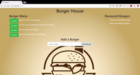

# burger

### Overview

####Burger is an app which allows users to 'eat' an existing burger from off the menu, or add their own burger to the menu.  This was made in order to gain experience with the MVC design pattern, using a MySQL database with Node, Express, Handlebars and a unique ORM.

##Demo:

